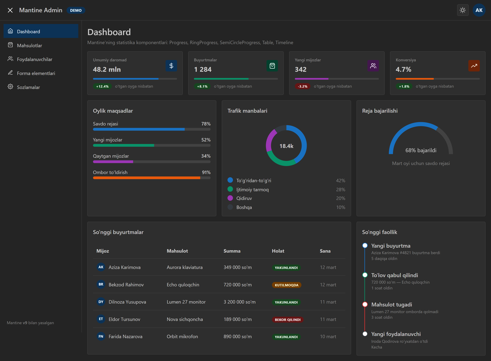
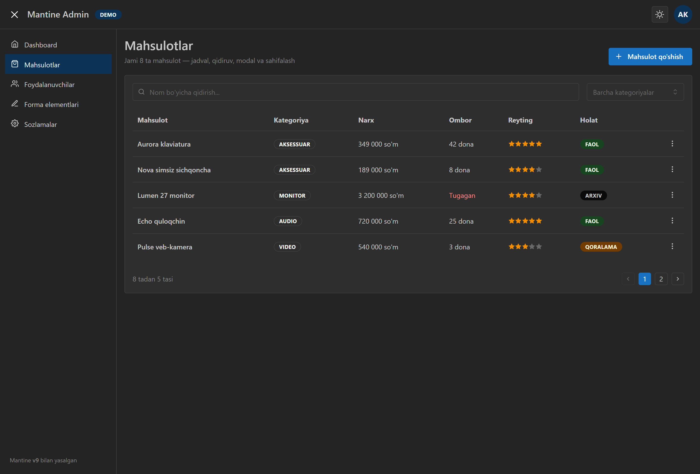
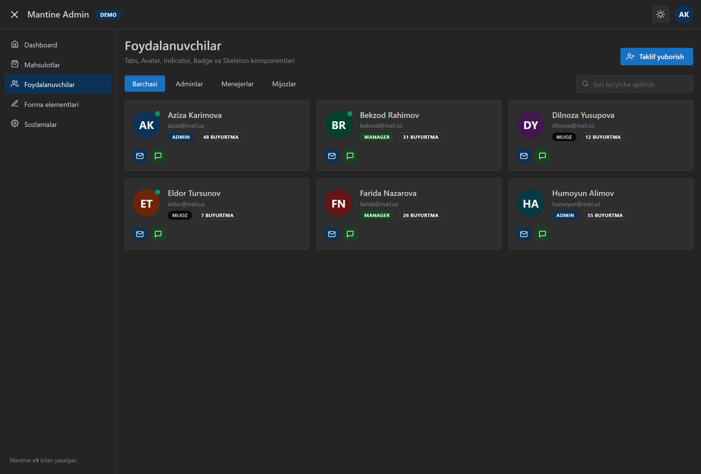
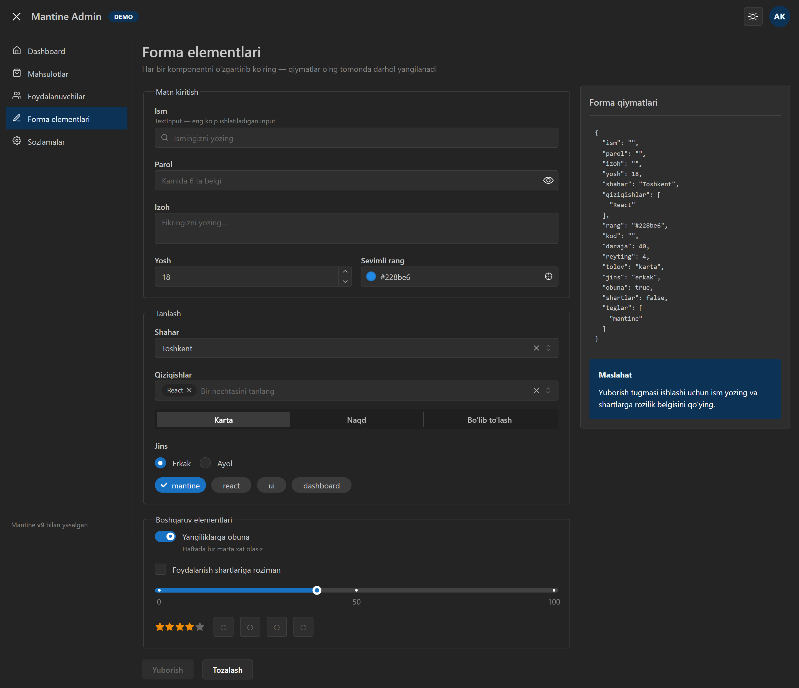
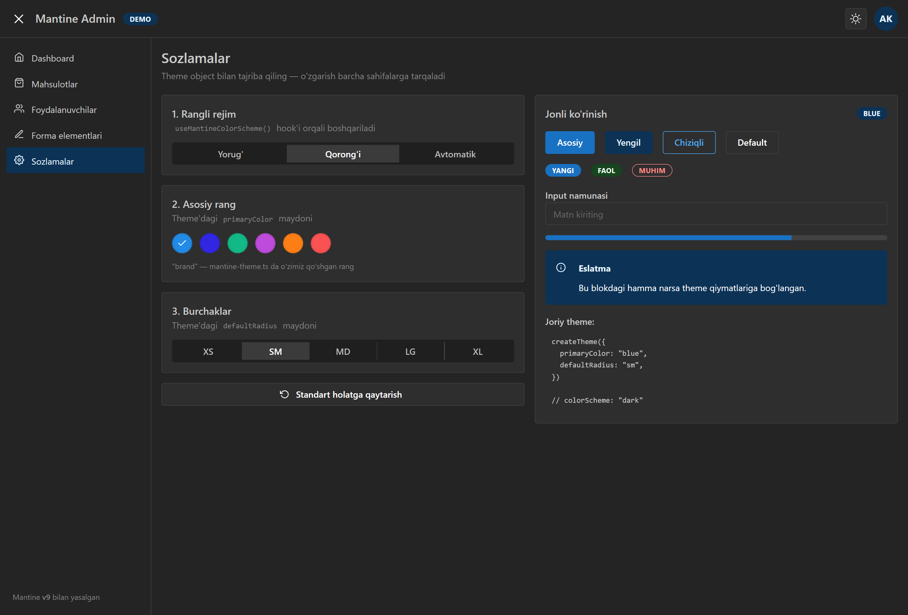

# Admin Dashboard

[](https://react.dev)
[](https://www.typescriptlang.org/)
[](https://mantine.dev/)
[](https://vite.dev/)
[](https://reactrouter.com/)
[](https://your-username.github.io/your-repo-name/)

A responsive admin dashboard built with React, TypeScript, Mantine UI, and React Router.

The project was created as a Mantine UI practice project, focusing on building a responsive interface and implementing interactive components and application state.

**Built with:** React · TypeScript · Mantine UI · Vite · React Router

[Visit Live 🚀](https://farhad-deve.github.io/mantine-admin)

## Table of Contents
- [Screenshots](#-screenshots)
- [Features](#-features)
- [Getting Started](#-getting-started)
- [Theme](#-theme)
- [Accessibility](#-accessibility)
- [Responsive Design](#-responsive-design)
- [License](#-license)

## 🖼️ Screenshots

| Dashboard | Products |
|---|---|
|  |  |

| Users | Forms |
|---|---|
|  |  |

| Settings |
|---|
|  |

## ✨ Features

### Dashboard
- Responsive dashboard layout
- Statistics cards
- Responsive grid layout

### Products
- Product table
- Product search
- Category filtering
- Pagination
- Add new products
- Delete products with confirmation
- Loading and empty states
- Responsive table layout

### Users
- Responsive user cards
- Role filtering with Tabs
- User search
- Avatar and status indicators
- Skeleton loading state

### Forms
- Multiple Mantine form components
- Controlled form state
- Form validation
- Password validation
- Real-time JSON preview
- Submit state
- Reset form
- Success alert

### Settings
- Light / dark / system theme
- Primary color selection
- Default radius selection
- Settings persistence with localStorage
- Reset settings to defaults

## 🚀 Getting Started

### Installation
Clone the repository and install the dependencies:

```bash
npm install
```

### Development
Start the development server:

```bash
npm run dev
```

### Production Build
Create a production build:

```bash
npm run build
```

### Preview Production Build
```bash
npm run preview
```

## 🎨 Theme
The application uses Mantine's theming system.

Users can customize:
- Primary color
- Default Radius
- Color scheme

The selected settings are persisted using `localStorage`.

## ♿ Accessibility

The application uses Mantine's accessible components and follows basic accessibility practices, including:
- Accessible labels for icon-only controls
- Proper form labels
- Keyboard-accessible interactive components
- Accessible modal dialogs
- Appropriate document language and metadata

## 📱 Responsive Design
The interface is designed to work across desktop, tablet, and mobile screen sizes using Mantine's responsive layout components and CSS utilities.

## 📄 License
This project was created for educational and practice purposes.